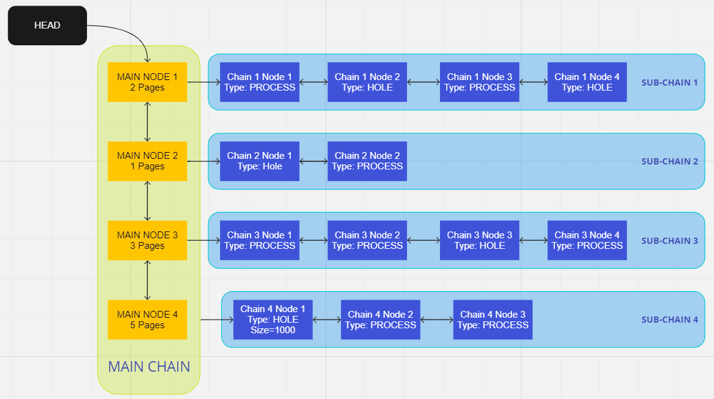

# MeMS: Memory Management System

MeMS is a user-space, memory-allocation library that mimics malloc(), a heap-memory allocation library. It utilizes the 'mmap()' system call underneath, requesting regions of mapped memory in multiples of page size (4096 Bytes).

A free list structure is used to manage the memory requested. This is also hosted on the mapped-memory region. 


The nodes contain pointers to the address of user-requested memory along with other additional attributes to facilitate re-usage of those pointers when freed.

# Usage 
The followng APIs are provided in MeMS:

## mems_malloc(int size)
Takes memory size as an argument and provides a void pointer to the user.

## mems_free(void* v_ptr)
Frees the chunk of memory requested prior by the user. For instance, if user has requested 250 bytes of memory and the  address is 0, then providing an address anywhere between 0 - 249 will free all 250 bytes.

## mems_print_stats()
Draws the free list and prints important information like pages used, memory unused, and lengths of main chain and sub chain. 

# Usage
## Shared object
To compile mems into a shared object `.so` file for dynamic linking across programs: 
```
$ make
```
A `mems.so` file will be generated in the `build` folder.

## Sample Program
A sample program utilizing MeMS is provided to demonstrate the usage of above APIs. To run this sample program, execute the following commands:

```
$ make example
$ ./example
```